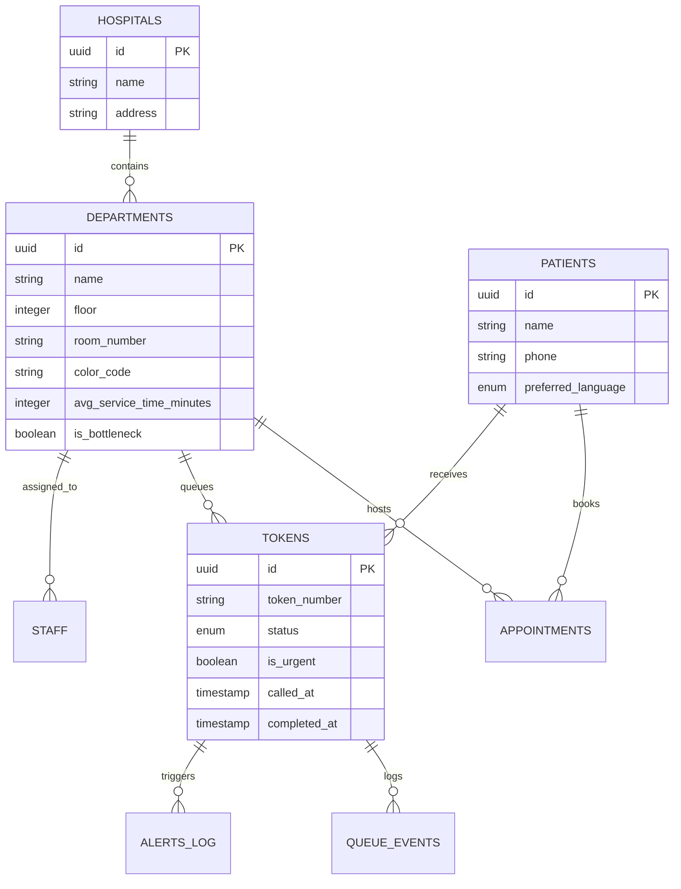

# Curaa 🏥✨
> **Hospital OPD Logistics Engine & Dynamic Queue Navigator**

[](https://react.dev/)
[](https://www.typescriptlang.org/)
[](https://vitejs.dev/)
[](https://tailwindcss.com/)
[](https://threejs.org/)
[](https://nodejs.org/)
[](https://supabase.com/)
[](LICENSE)

**Curaa** is an intelligent, real-time hospital Outpatient Department (OPD) queue navigation platform. Designed to eliminate waiting room anxiety and hospital overcrowding, Curaa turns complex hospital visits into streamlined, stress-free journeys through dynamic queue routing, multilingual AI logistics guidance, immersive 3D virtual waiting lounges, real-time status updates, and predictive analytics for hospital administration.

---

## 📌 Table of Contents

- [✨ Key Features](#-key-features)
- [🏗️ System Architecture](#️-system-architecture)
- [🛠️ Tech Stack](#️-tech-stack)
- [📂 Project Structure](#-project-structure)
- [⚡ Quick Start & Setup Guide](#-quick-start--setup-guide)
  - [1. Prerequisites](#1-prerequisites)
  - [2. Repository Setup](#2-repository-setup)
  - [3. Supabase Database Configuration](#3-supabase-database-configuration)
  - [4. Backend Setup](#4-backend-setup)
  - [5. Frontend Setup](#5-frontend-setup)
- [🔑 Environment Variables Reference](#-environment-variables-reference)
- [🗄️ Database Schema Overview](#️-database-schema-overview)
- [🤖 Multilingual AI Navigation Engine](#-multilingual-ai-navigation-engine)
- [👓 3D VR Waiting Room Lounge](#-3d-vr-waiting-room-lounge)
- [🤝 Contributing](#-contributing)
- [📄 License](#-license)

---

## ✨ Key Features

### 📲 1. Self-Service Patient Check-In & Token Generation
- **QR Code & Web Check-in**: Patients check in instantly upon arrival using phone or kiosk.
- **Multilingual Support**: Supports **English**, **Hindi (हिंदी)**, and **Gujarati (ગુજરાતી)**.
- **Dynamic Token Prefixing**: Automatic token assignment matching hospital workflows (`REG-101`, `BIL-102`, `LAB-103`, `OPD-104`, `PHA-105`).

### ⏱️ 2. Real-Time Patient Queue Portal
- **Live Queue Counter**: Displays real-time position ahead and estimated wait times.
- **Visual OPD Progression**: Interactive step-by-step hospital workflow tracker (*Registration ➔ Billing ➔ Lab ➔ OPD Consultation ➔ Pharmacy*).
- **Interactive Floor Map**: Highlights department floor numbers, room numbers, and color-coded zones.

### 🤖 3. Multilingual AI OPD Logistics Assistant
- **Logistics & Workflow Guidance**: Answers questions regarding room numbers, queue positions, delays, and department locations.
- **Built-In Medical Guardrails**: Strictly refuses medical/diagnostic queries to protect patient safety.
- **Multilingual NLP**: Seamlessly responds in the patient's selected language.
- **Rule-Based AI Engine**: Local engine provides instantaneous response and guidance.

### 👓 4. Immersive 3D VR Waiting Lounge (Three.js WebGL & GSAP)
- **Interactive 3D Environment**: Relaxing WebGL 3D virtual environment with dynamic particle lighting, glassmorphic UI overlay, and ambient audio controls.
- **Live Queue HUD Ticker**: Keep track of queue status without leaving the relaxing 3D lounge.

### 👨‍⚕️ 5. Staff Operating Desk & Emergency Overrides
- **Live Station Queue Management**: Call Next Patient, Mark Completed, Skip, or Re-route tokens.
- **Urgent Priority Escalation**: One-click emergency priority tagging to bump critical patients to the top of the queue.
- **Multi-Department Switcher**: Allows staff to switch control across Registration, Billing, Lab, OPD Rooms, and Pharmacy.

### 📊 6. Admin Analytics & Bottleneck Monitoring (Recharts)
- **Real-Time KPI Metrics**: Track total patients, average wait times, completed visits, and bottleneck alerts.
- **Department Throughput**: Dynamic charts visualizing department velocity and peak load times.
- **Automated Delay Warnings**: Automatic alert flags when service times exceed department thresholds.

### 🔔 7. Multi-Channel Background Alert Worker
- **Rate-Limited Worker Loop**: Asynchronous queue processor checking pending notifications every 5 seconds.
- **Twilio SMS / WhatsApp Dispatch**: Direct notifications sent when a patient is next in line.
- **In-App Realtime Push**: Instant UI updates via Supabase PostgreSQL real-time listeners.

---

## 🏗️ System Architecture

```text
 ┌─────────────────────────────────────────────────────────────────────────────┐
 │                             CLIENT LAYER (Frontend)                         │
 │                                                                             │
 │  ┌─────────────────┐   ┌──────────────────┐   ┌──────────────────────────┐  │
 │  │ Patient Portal  │   │  Staff Desk      │   │  3D VR Lounge (Three.js) │  │
 │  └────────┬────────┘   └────────┬─────────┘   └────────────┬─────────────┘  │
 └───────────┼─────────────────────┼──────────────────────────┼────────────────┘
             │                     │                          │
             ▼                     ▼                          ▼
 ┌─────────────────────────────────────────────────────────────────────────────┐
 │                         BACKEND REST API (Express / Node.js)                │
 │                                                                             │
 │  • /api/check-in      • /api/queue/:deptId       • /api/call-next           │
 │  • /api/patient/:id   • /api/agent/chat          • /api/admin/metrics       │
 └───────────┬─────────────────────┬──────────────────────────┬────────────────┘
             │                     │                          │
             ▼                     ▼                          ▼
 ┌──────────────────────┐  ┌──────────────────────┐  ┌─────────────────────────┐
 │   Supabase Database  │  │   Multilingual AI    │  │   Twilio SMS / WhatsApp │
 │  (PostgreSQL + RLS)  │  │  (Logistics Engine)  │  │    (Background Worker)  │
 └──────────────────────┘  └──────────────────────┘  └─────────────────────────┘
```

---

## 🛠️ Tech Stack

### **Frontend**
- **Framework**: [React 19](https://react.dev/) + [Vite 8](https://vitejs.dev/)
- **Language**: [TypeScript](https://www.typescriptlang.org/)
- **Styling**: [Tailwind CSS v4](https://tailwindcss.com/) + Glassmorphism & Custom Animations
- **3D & Visual Effects**: [Three.js](https://threejs.org/) + `@types/three` + [GSAP](https://gsap.com/)
- **Animations & UI**: [Framer Motion](https://www.framer.com/motion/) + [Lucide Icons](https://lucide.dev/)
- **Charts & Data**: [Recharts](https://recharts.org/)
- **Linting**: [Oxlint](https://oxc.rs/)

### **Backend**
- **Runtime**: [Node.js](https://nodejs.org/) + Express
- **Language**: TypeScript (`ts-node-dev`)
- **AI Agent**: Rule-Based Multilingual Logistics Engine
- **Database Client**: `@supabase/supabase-js`
- **Communications**: Twilio SMS Integration

### **Database & Infrastructure**
- **Database**: Supabase PostgreSQL
- **Security**: Row Level Security (RLS) policies
- **Realtime**: Supabase WebSockets / Event Broadcasting

---

## 📂 Project Structure

```text
Curaa/
├── frontend/                     # React 19 Frontend Application
│   ├── public/                   # Static assets & icons
│   ├── src/
│   │   ├── components/           # UI Components & 3D WebGL Canvas
│   │   │   ├── AmbientBackground.tsx
│   │   │   ├── AnimatedCounter.tsx
│   │   │   ├── CursorSpotlight.tsx
│   │   │   ├── GlassCard3D.tsx
│   │   │   ├── Hero3DVisualizer.tsx
│   │   │   ├── HolographicPortal3D.tsx
│   │   │   ├── ProtectedRoute.tsx
│   │   │   ├── TiltCard.tsx
│   │   │   └── WaitingRoom3DCanvas.tsx  # Interactive 3D Lounge Component
│   │   ├── context/
│   │   │   └── AuthContext.tsx   # Google & Phone Auth Session Management
│   │   ├── lib/
│   │   │   └── supabaseClient.ts # Client-side Supabase connection
│   │   ├── pages/
│   │   │   ├── AdminDashboard.tsx       # System Analytics & Bottlenecks
│   │   │   ├── LoginPage.tsx            # Multi-method Auth Page
│   │   │   ├── PatientCheckIn.tsx       # Patient Registration & QR Entry
│   │   │   ├── PatientPortal.tsx        # Live Patient Ticket & AI Chat
│   │   │   ├── StaffDashboard.tsx       # Counter Desk Control Panel
│   │   │   └── WaitingRoom3DPage.tsx    # 3D VR Waiting Room Lounge
│   │   ├── App.tsx               # Main Router & Ambient Layout
│   │   ├── main.tsx              # Application Entrypoint
│   │   └── index.css             # Tailwind v4 & Glassmorphism Design Tokens
│   ├── package.json
│   └── vite.config.ts
│
├── backend/                      # Express TypeScript Backend API
│   ├── src/
│   │   ├── agent.ts              # Rule-Based Multilingual Logistics Agent
│   │   ├── db.ts                 # Supabase Backend Service Role Client
│   │   ├── routes.ts             # REST API Controllers (Check-in, Queue, Call)
│   │   ├── seed.ts               # Programmatic Database Seeder
│   │   └── server.ts             # Express Server & Alert Queue Worker
│   ├── package.json
│   └── tsconfig.json
│
├── supabase/                     # Database Migrations & Seeds
│   ├── schema.sql                # Full DB Schema, Enums, RLS Policies & Indexes
│   └── seed.sql                  # Default SQL Seed Data
│
└── README.md                     # Project Documentation
```

---

## ⚡ Quick Start & Setup Guide

### 1. Prerequisites
Ensure you have the following installed on your development machine:
- **Node.js** (v18.0.0 or higher)
- **npm** (v9.0.0 or higher)
- A **Supabase** account (Free tier works great)
- *(Optional)* A **Twilio** Account (for SMS dispatch)

---

### 2. Repository Setup

Clone the repository to your local machine:
```bash
git clone https://github.com/AtharvaK-XD/Curaa.git
cd Curaa
```

---

### 3. Supabase Database Configuration

1. Create a new project in your [Supabase Dashboard](https://database.new).
2. Open the **SQL Editor** in Supabase.
3. Copy the contents of [`supabase/schema.sql`](file:///c:/Users/ATHARVA/Desktop/Curaa/supabase/schema.sql) and run it to create tables, enums, indexes, and RLS policies.
4. Copy the contents of [`supabase/seed.sql`](file:///c:/Users/ATHARVA/Desktop/Curaa/supabase/seed.sql) and run it to populate initial hospital departments and staff records.

---

### 4. Backend Setup

1. Navigate to the backend folder:
   ```bash
   cd backend
   ```

2. Install dependencies:
   ```bash
   npm install
   ```

3. Create a `.env` file in the `backend/` directory:
   ```env
   PORT=5000
   SUPABASE_URL=https://your-project-id.supabase.co
   SUPABASE_ANON_KEY=your-supabase-anon-key
   SUPABASE_SERVICE_ROLE_KEY=your-supabase-service-role-key

   # Twilio Config (Optional - Simulated in console if omitted)
   TWILIO_ACCOUNT_SID=
   TWILIO_AUTH_TOKEN=
   TWILIO_PHONE_NUMBER=
   ```

4. Seed the database programmatically (optional step):
   ```bash
   npm run seed
   ```

5. Start the backend development server:
   ```bash
   npm run dev
   ```
   *The API server will run at `http://localhost:5000` with the background alert worker activated.*

---

### 5. Frontend Setup

1. Open a new terminal tab and navigate to the frontend directory:
   ```bash
   cd frontend
   ```

2. Install dependencies:
   ```bash
   npm install
   ```

3. Create a `.env` file in the `frontend/` directory:
   ```env
   VITE_SUPABASE_URL=https://your-project-id.supabase.co
   VITE_SUPABASE_ANON_KEY=your-supabase-anon-key
   VITE_API_URL=http://localhost:5000/api
   ```

4. Launch the frontend Vite development server:
   ```bash
   npm run dev
   ```

5. Open your browser and navigate to:
   ```text
   http://localhost:5173
   ```

---

## 🔑 Environment Variables Reference

### Frontend (`frontend/.env`)
| Variable | Required | Description |
| :--- | :---: | :--- |
| `VITE_SUPABASE_URL` | Yes | Your Supabase project URL |
| `VITE_SUPABASE_ANON_KEY` | Yes | Supabase Anonymous public API key |
| `VITE_API_URL` | Yes | Backend REST API endpoint (default: `http://localhost:5000/api`) |

### Backend (`backend/.env`)
| Variable | Required | Description |
| :--- | :---: | :--- |
| `PORT` | No | Server port (default: `5000`) |
| `SUPABASE_URL` | Yes | Your Supabase project URL |
| `SUPABASE_ANON_KEY` | Yes | Supabase Anonymous public API key |
| `SUPABASE_SERVICE_ROLE_KEY` | Yes | Supabase Service Role key (bypasses RLS for worker tasks) |
| `TWILIO_ACCOUNT_SID` | No | Twilio Account SID for SMS notifications |
| `TWILIO_AUTH_TOKEN` | No | Twilio Auth Token |
| `TWILIO_PHONE_NUMBER` | No | Twilio Phone Number |

---

## 🗄️ Database Schema Overview

The database is built on PostgreSQL with Supabase RLS policies enabled.



---

## 🤖 Multilingual AI Navigation Engine

Curaa features a specialized AI Assistant tailored for hospital logistics:

1. **Context-Aware Prompt Injection**: Dynamically incorporates the patient's token number, current department, room location, queue position, estimated wait time, and bottleneck status.
2. **Multilingual Intelligence**: Native fluency in **English**, **Hindi**, and **Gujarati**.
3. **Medical Safety Policy**: Automatic query inspection blocks diagnostic advice and redirects patients to attending doctors:
   > *"I am a queue navigation assistant and cannot provide medical advice. Please consult your doctor directly."*
4. **Local Rule-Based Engine**: A smart, multilingual regex engine provides instantaneous guidance for room locations and wait time inquiries.

---

## 👓 3D VR Waiting Room Lounge

To ease patient stress while waiting, Curaa offers an interactive **WebGL 3D Waiting Room**:

- **Real-Time WebGL Visuals**: Interactive dynamic geometry rendered using Three.js and smoothed with GSAP.
- **Glassmorphic HUD Ticker**: Live real-time token status overlays directly inside the 3D space.
- **Ambient Lighting Controls**: Ambient lighting modes designed for calming hospital environments.

---

## 🤝 Contributing

Contributions are warmly welcomed! To contribute:

1. Fork the Repository.
2. Create a Feature Branch (`git checkout -b feature/AmazingFeature`).
3. Commit your changes (`git commit -m 'Add basic feature'`).
4. Push to the Branch (`git push origin feature/AmazingFeature`).
5. Open a Pull Request.

